# Java

## Descrpción

En este repositorio se encuentran los ejercicios y las explicaciones del Trainer organizadas en carpetas que están nombrados por los días de trabajo. Como podemos observar, hacen falta dos días iniciales y esto se debe a que estábamos en refuerzo así que esos no se contaron. En el día 9 se realizaron unos ejercicios en la plataforma de Hackerrank y por eso no está esa carpeta.

## Tecnologías utilizadas
|Java|
|-|
||

## Estructura
|**Dia 3**| **Dia 5**| 
|-|-|
|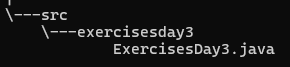|**Ejemplo del Trainer** 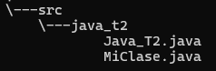 **Actividad**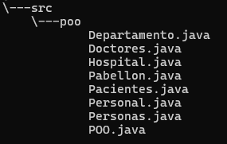|
|**Dia 6**|**Dia 7**|
|**Ejemplo del Trainer**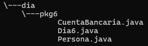 **Actividad 1**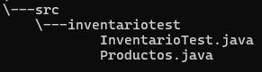 **Actividad 2**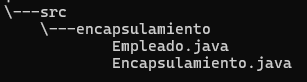 **Actividad 3**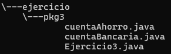|**Ejemplo del Trainer**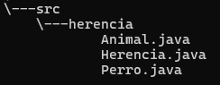 **Actividad 1**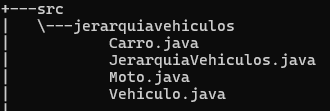 **Actividad 2**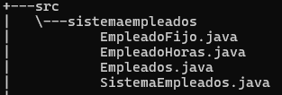|
|**Dia 8**|
|**Actividad**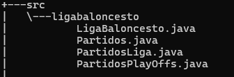|

## Características
|Nombre|Descripción|
|-|-|
|**Dia 3**|Se realizaron diferentes ejercicios sobre ciclos ejecutándose con un menú de opciones.|
|**Dia 5**|Se manejó la organización de las clases creadas y se creó un sencillo menú para su funcionamiento.|
|**Dia 6**|Manejo de encapsulamiento en tres ejercicios asignados por el Trainer.|
|**Dia 7**|Uso de herencia y polimorfismo en dos ejercicios para reforzar el tema visto en clase.|
|**Dia 8**|Uso de arreglos y listas con un pequeño menú para conocer su funcionamiento.|

## Instrucciones

**1.** Clonar el repositorio cargado en GitHub.

**2.** Abrir su editor de código y elegir el archivo que acaba de clonar.

**3.** Elegir una de las carpetas y correr el código. 

**4.** Seguir los pasos o las indicaciones sugeridas en cada programa.

## Desarrollado por

Los trabajos fueron realizados por Alejandra Machuca, estudiante de CampusLands para el módulo de Java.